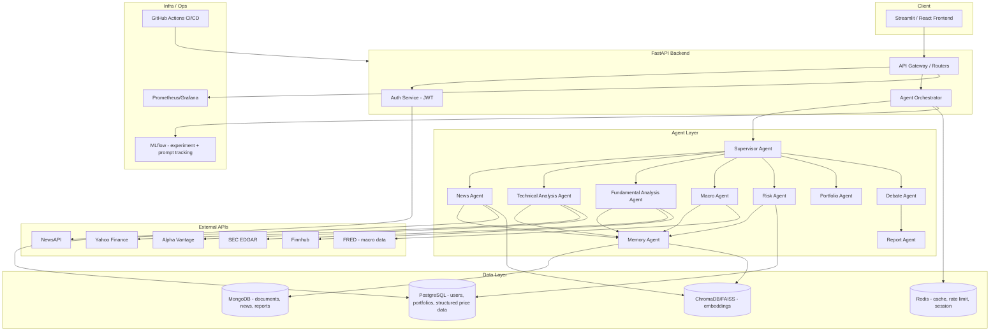
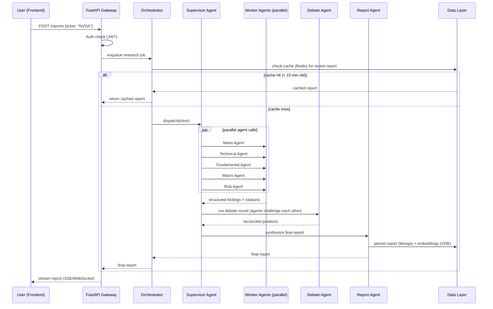
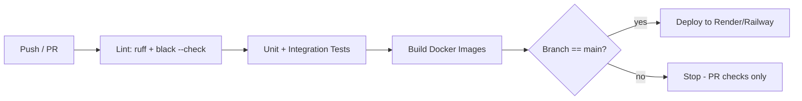

# PROJECT_GUIDE.md
## AI Multi-Agent Stock Research Platform — Master Implementation Guide

> Inspired by the academic prototype **StockAgent** (Zhang, Liu, Jin et al., 2024, arXiv:2407.18957), this guide specifies a production-grade evolution of that idea: instead of a closed trading *simulation*, you will build an **investment research platform** — multiple LLM-driven agents that gather real market data, real news, real fundamentals, debate an investment thesis, and produce a cited, explainable research report. This is intentionally a different (and more employable) product shape than the original repo: research/decision-support rather than autonomous trading, which sidesteps both regulatory and safety issues around real-money autonomous trading while still showcasing every skill a trading-agent project would.

---

## Table of Contents

1. Executive Summary
2. Skills Demonstrated
3. Complete System Architecture
4. Folder Structure
5. Technology Stack
6. Project Phases (1–20)
7. Data Pipeline
8. AI Agents
9. Retrieval-Augmented Generation
10. Databases
11. External APIs
12. Backend (FastAPI)
13. Frontend (Streamlit)
14. Authentication
15. Deployment
16. MLOps
17. Testing
18. CI/CD
19. Logging
20. Security
21. Performance Optimization
22. Future Improvements (50+)
23. Learning Resources
24. Interview Preparation (50 Q&A)
25. Resume Bullet Points
26. GitHub README Plan
27. Milestone Checklist

---

# 1. Executive Summary

## 1.1 Project Vision

Build **FinSight** (working name — rename freely): a multi-agent AI system where specialized LLM agents each own one lens on a stock — technicals, fundamentals, news sentiment, macro context, and risk — and a **Supervisor Agent** orchestrates a structured debate between them before a **Report Agent** synthesizes a single, citation-backed investment memo. The system is read/research-only: it never places real trades, which keeps scope, liability, and compliance concerns manageable while preserving 100% of the interesting engineering.

## 1.2 Objective

Produce a portfolio project that proves you can:

- Design and orchestrate a **multi-agent LLM system** (not just a single chatbot wrapper).
- Build a real **data pipeline** against live financial/news APIs, with cleaning, storage, and caching.
- Implement **RAG** correctly (chunking, embeddings, retrieval, reranking, citation, hallucination mitigation) over financial documents (10-Ks, earnings calls, news).
- Ship it as a **real service**: FastAPI backend, typed schemas, auth, a usable frontend, containerized, tested, CI/CD'd, deployed, and monitored.
- Reason clearly, in an interview, about trade-offs you made (why MongoDB *and* Postgres, why FAISS vs a hosted vector DB, why you rejected letting agents place real trades, etc.).

## 1.3 Motivation

Generic "call an LLM API and print the answer" projects are now table stakes and do not differentiate a candidate. What *does* differentiate a candidate in 2025–2026 hiring cycles is evidence of:

- Systems thinking (how components fail, retry, degrade).
- Multi-agent orchestration (a genuinely emerging, in-demand skill).
- Applied RAG done correctly (most junior candidates get chunking/citation wrong).
- Production hygiene (tests, CI, containers, observability) — the difference between a notebook and a platform.

This project is scoped so that a motivated intermediate-Python engineer can build a materially complete version in **4–8 weeks part-time**, with clear stopping points if time is short (see §6 Phases and §27 Checklist for a "minimum viable portfolio" cut line).

## 1.4 Expected Outcome

A deployed, publicly linkable web app where a visitor types a ticker (e.g., `NVDA`), watches agents work (streamed reasoning), and receives a structured report: price/technical read, fundamental snapshot, recent news sentiment, macro considerations, a risk section, and a final synthesized view — every non-trivial claim backed by a retrieved source. Plus: a GitHub repo with tests, CI badge, Docker Compose one-command local run, and architecture docs.

## 1.5 Technologies

Python 3.11+, FastAPI, Streamlit (or React if you want extra frontend credit — see §13), MongoDB, PostgreSQL, Redis, a vector store (ChromaDB or FAISS, with a note on Pinecone/Qdrant as the "hosted" alternative), an LLM provider (Claude and/or GPT via API), LangGraph or a hand-rolled orchestrator for agent control flow, Docker/Docker Compose, GitHub Actions, MLflow (lightweight use), Prometheus/Grafana or a hosted equivalent for monitoring.

## 1.6 AI Concepts Demonstrated

Prompt engineering and prompt versioning; tool-calling/function-calling agents; multi-agent debate and supervisor/orchestrator patterns; RAG (embedding, chunking, retrieval, reranking); hallucination mitigation via citation-forcing; agent memory (short-term conversation state vs long-term vector memory); evaluation of LLM outputs (both automated and rubric-based); basic quantitative finance (technical indicators, fundamental ratios, portfolio risk metrics).

## 1.7 Explicit Non-Goals

State these in your README too — they show maturity:

- **Not** a real trading bot; it never executes trades or connects to a brokerage.
- **Not** investment advice; every report should carry a disclaimer.
- **Not** attempting to beat the market or backtest alpha generation — the value is in explainable synthesis, not in claimed returns.

---

# 2. Skills Demonstrated

| Domain | How this project demonstrates it |
|---|---|
| Machine Learning | Feature engineering on price series (technical indicators), portfolio risk modeling (VaR, Sharpe, volatility), evaluation metrics for agent outputs |
| Deep Learning | Embedding models for RAG, understanding of transformer-based LLM behavior (context windows, temperature, tool use) |
| NLP | News sentiment analysis, entity extraction from filings, summarization of earnings calls |
| LLMs | Prompt design per agent role, structured output (JSON mode / function calling), model comparison (Claude vs GPT vs open-weight) |
| RAG | Full pipeline: ingestion → chunking → embedding → retrieval → reranking → citation |
| Prompt Engineering | Role-specific system prompts, few-shot examples, chain-of-thought where appropriate, prompt versioning and regression testing |
| Multi-Agent Systems | Supervisor/worker pattern, structured debate, shared blackboard/memory, failure isolation between agents |
| Financial AI | Technical analysis (RSI, MACD, moving averages), fundamental analysis (P/E, D/E, margins), macro-awareness (rates, CPI), risk metrics |
| Software Engineering | Layered architecture (routers/services/repositories), dependency injection, typed schemas (Pydantic), clean folder structure |
| Cloud | Deployment to at least one of Render/Railway/AWS/GCP/Azure, environment-based configuration |
| Docker | Multi-stage builds, Docker Compose for local orchestration of app + databases |
| MLOps | Prompt/version tracking, experiment logging (MLflow), evaluation dashboards |
| Git | Conventional commits, feature branches, PR-based workflow (even solo) |
| CI/CD | GitHub Actions: lint → test → build → deploy pipeline |
| REST APIs | FastAPI routers, OpenAPI docs, versioned endpoints |
| MongoDB | Document storage for unstructured agent outputs, news, filings |
| Vector Databases | ChromaDB/FAISS for RAG retrieval, embedding storage |
| Data Pipelines | Scheduled ingestion, cleaning, caching, incremental updates |
| Python | Async/await, typing, packaging, testing idioms |
| FastAPI | Production API patterns: dependency injection, background tasks, streaming responses |
| Streamlit | Multi-page dashboard app consuming the backend API |

---

# 3. Complete System Architecture

## 3.1 High-Level Component Diagram



## 3.2 Request Lifecycle (Sequence)



## 3.3 Data Flow Summary

1. **Ingestion**: scheduled jobs (or on-demand, cached) pull prices, news, filings, macro series from external APIs.
2. **Normalization**: raw payloads are cleaned into typed Pydantic models, stored in MongoDB (unstructured: news/filings/agent outputs) and PostgreSQL (structured: OHLCV price bars, users, portfolios).
3. **Embedding**: news articles and filing sections are chunked and embedded into the vector DB for RAG.
4. **Agent execution**: the Supervisor dispatches worker agents in parallel (async), each pulling only the data/tools it needs, returning structured JSON with citations.
5. **Debate**: agents that disagree (e.g., Technical says "bullish momentum," Fundamental says "overvalued") are given each other's findings and asked to respond — this is what makes the report feel *reasoned* rather than five disconnected paragraphs.
6. **Synthesis**: the Report Agent merges everything into one document with a clear structure and inline citations back to source documents.
7. **Delivery**: the frontend streams agent progress and the final report; everything is cached and persisted for later retrieval.

## 3.4 Why This Architecture (Trade-offs)

- **Two SQL/NoSQL stores, not one**: PostgreSQL for anything relational/transactional (users, portfolios, price bars you'll query with aggregations) — MongoDB for heterogeneous, schema-shifting documents (raw news, agent outputs, filings). Using Mongo for *everything* is a common junior mistake that becomes painful once you need joins (e.g., "show me all reports for tickers in this user's portfolio").
- **Redis for cache + light job queue**, not a full message broker initially — Celery/RQ backed by Redis is enough for this project's scale; only mention Kafka/RabbitMQ as a "future improvement," don't over-engineer it now.
- **Vector DB choice**: start with **ChromaDB** (embedded, zero infra) for local dev, and document FAISS as an alternative for pure in-process speed, and Pinecone/Qdrant as the "if this were multi-tenant SaaS" answer. Being able to explain *why* you'd swap is worth more than which one you picked.
- **Orchestration**: hand-roll the supervisor/worker loop first (you must understand it to explain it), then optionally port to LangGraph in a later phase to show framework fluency too.

---

# 4. Folder Structure

```
finsight/
├── backend/
│   ├── app/
│   │   ├── main.py                  # FastAPI app factory, startup/shutdown events
│   │   ├── core/
│   │   │   ├── config.py            # Pydantic Settings (env-based config)
│   │   │   ├── security.py          # JWT creation/verification, password hashing
│   │   │   ├── logging.py           # structured logging setup
│   │   │   └── exceptions.py        # custom exception classes + handlers
│   │   ├── api/
│   │   │   ├── deps.py              # shared FastAPI dependencies (get_db, get_current_user)
│   │   │   └── v1/
│   │   │       ├── routers/
│   │   │       │   ├── auth.py
│   │   │       │   ├── reports.py
│   │   │       │   ├── portfolios.py
│   │   │       │   ├── watchlist.py
│   │   │       │   └── health.py
│   │   │       └── __init__.py      # aggregates routers under /api/v1
│   │   ├── agents/
│   │   │   ├── base.py              # BaseAgent abstract class
│   │   │   ├── supervisor.py
│   │   │   ├── news_agent.py
│   │   │   ├── technical_agent.py
│   │   │   ├── fundamental_agent.py
│   │   │   ├── macro_agent.py
│   │   │   ├── risk_agent.py
│   │   │   ├── portfolio_agent.py
│   │   │   ├── memory_agent.py
│   │   │   ├── debate_agent.py
│   │   │   ├── report_agent.py
│   │   │   └── prompts/             # one .md or .yaml per agent, versioned
│   │   ├── services/
│   │   │   ├── market_data_service.py
│   │   │   ├── news_service.py
│   │   │   ├── fundamentals_service.py
│   │   │   ├── macro_service.py
│   │   │   ├── rag_service.py
│   │   │   ├── report_service.py
│   │   │   └── llm_client.py        # thin wrapper around Claude/OpenAI SDKs
│   │   ├── repositories/
│   │   │   ├── mongo_repo.py
│   │   │   ├── postgres_repo.py
│   │   │   └── vector_repo.py
│   │   ├── schemas/                 # Pydantic request/response models
│   │   │   ├── report.py
│   │   │   ├── user.py
│   │   │   ├── portfolio.py
│   │   │   └── agent_io.py
│   │   ├── models/                  # SQLAlchemy ORM models (Postgres)
│   │   │   ├── user.py
│   │   │   ├── portfolio.py
│   │   │   └── price_bar.py
│   │   ├── orchestration/
│   │   │   ├── orchestrator.py      # dispatch logic, parallelism, retries
│   │   │   └── graph.py             # optional LangGraph definition
│   │   └── tasks/
│   │       ├── ingestion_jobs.py    # scheduled data pulls
│   │       └── worker.py            # Celery/RQ worker entrypoint
│   ├── tests/
│   │   ├── unit/
│   │   ├── integration/
│   │   └── agents/
│   ├── alembic/                     # DB migrations for Postgres
│   ├── pyproject.toml
│   ├── requirements.txt
│   └── Dockerfile
├── frontend/
│   ├── streamlit_app/
│   │   ├── Home.py
│   │   ├── pages/
│   │   │   ├── 1_Dashboard.py
│   │   │   ├── 2_Portfolio.py
│   │   │   ├── 3_Watchlist.py
│   │   │   ├── 4_Reports.py
│   │   │   └── 5_Settings.py
│   │   └── components/
│   ├── requirements.txt
│   └── Dockerfile
├── infra/
│   ├── docker-compose.yml
│   ├── docker-compose.prod.yml
│   └── k8s/                          # optional, future improvement
├── mlops/
│   ├── mlflow/
│   └── eval/
│       ├── prompt_regression_tests.py
│       └── golden_datasets/
├── scripts/
│   ├── seed_db.py
│   └── run_ingestion.py
├── docs/
│   ├── architecture.md
│   ├── api.md
│   └── diagrams/
├── .github/
│   └── workflows/
│       ├── ci.yml
│       └── deploy.yml
├── .env.example
├── README.md
└── PROJECT_GUIDE.md
```

**Naming conventions**: snake_case for Python files/functions, PascalCase for classes, one router per resource, one service per external concern, repositories never imported directly by routers (always through services) — this layering is what interviewers mean by "separation of concerns," and you should be able to point at this folder tree and explain each boundary.

---

# 5. Technology Stack

| Technology | Purpose | Alternatives | Reason for Choosing | Difficulty |
|---|---|---|---|---|
| Python 3.11+ | Core language | Node.js/TypeScript | Best ecosystem for ML/finance libs | Low |
| FastAPI | Backend API framework | Flask, Django REST | Native async, auto OpenAPI docs, Pydantic integration | Medium |
| Pydantic v2 | Data validation/schemas | marshmallow, attrs | Speed, native FastAPI integration | Low |
| Streamlit | Rapid frontend dashboard | React + Vite, Next.js | Fastest path to a usable demo; swap to React later for extra frontend credit | Low–Medium |
| MongoDB | Unstructured document storage | Firestore, DynamoDB | Flexible schema for news/filings/agent outputs | Medium |
| PostgreSQL | Structured/relational storage | MySQL | Strong relational + JSONB hybrid, great for users/portfolios/price bars | Medium |
| Redis | Caching, rate limiting, job queue | Memcached | Multi-purpose, simple ops | Low |
| ChromaDB | Vector store (dev) | FAISS, Pinecone, Qdrant, Weaviate | Zero-infra local dev; easy swap later | Low |
| Claude / OpenAI API | LLM backbone | Local open-weight models (Llama, Mistral) | Best reasoning/tool-use quality for a portfolio-quality demo | Medium |
| LangGraph (optional, Phase 11+) | Agent orchestration framework | AutoGen, CrewAI, hand-rolled | Shows framework fluency after you've proven you understand the pattern manually | Medium–High |
| Docker / Docker Compose | Containerization | Podman | Industry standard, one-command local env | Medium |
| GitHub Actions | CI/CD | GitLab CI, CircleCI | Free, tightly integrated with GitHub | Medium |
| MLflow | Experiment/prompt tracking | Weights & Biases | Free, self-hostable, good enough for solo project scale | Medium |
| Prometheus + Grafana | Monitoring | Datadog (paid), hosted alternative | Free, standard, resume-recognizable | Medium–High |
| SQLAlchemy + Alembic | ORM + migrations | Tortoise ORM | Mature, works well with FastAPI | Medium |
| Celery or RQ | Background jobs | Dramatiq | Simple scheduled ingestion without full message broker | Medium |
| yfinance / Alpha Vantage / Finnhub | Market data | Polygon.io | Free tiers sufficient for a demo | Low |
| NewsAPI | News ingestion | GNews, Marketaux | Simple free tier | Low |
| SEC EDGAR (via `edgartools` or raw API) | Fundamentals/filings | Financial Modeling Prep | Free, authoritative primary source | Medium |
| FRED API | Macro data (rates, CPI) | World Bank API | Free, authoritative, St. Louis Fed | Low |
| pytest | Testing | unittest | Ecosystem, fixtures, async support | Low |
| Render / Railway | Deployment (simplest path) | AWS/GCP/Azure | Free/cheap tier, fast to deploy, still resume-credible if you *also* document what AWS deployment would look like | Low–Medium |

---

# 6. Project Phases

Each phase lists objectives, deliverables, dependencies, an estimated time budget (assuming ~10–15 hrs/week part-time), common mistakes, a testing note, and a suggested commit message. Treat hour estimates as ranges, not promises — your mileage will vary with prior experience.

> **Minimum Viable Portfolio (MVP) cut line**: if you're short on time, Phases 1–8, 10–11, 14, 18 (basic), and 20 alone still produce a demoable, defensible project. Phases 9, 12–13, 15–17, 19 are what take it from "good bootcamp project" to "clearly production-minded."

## Phase 1 — Environment Setup
- **Objectives**: repo scaffolding, virtualenv/poetry, `.env` handling, Docker Compose skeleton (empty services), pre-commit hooks (black, ruff, isort).
- **Deliverables**: repo builds and runs `docker compose up` with a "hello world" FastAPI route and a placeholder Streamlit page.
- **Dependencies**: none.
- **Est. hours**: 3–5.
- **Common mistakes**: committing `.env` with real keys; skipping `.env.example`; not pinning dependency versions early (causes "works on my machine" pain later).
- **Testing strategy**: a single smoke test hitting `/health`.
- **Commit**: `chore: scaffold repo, docker-compose skeleton, CI stub`

## Phase 2 — Data Collection
- **Objectives**: build `market_data_service.py` wrapping yfinance/Alpha Vantage; handle rate limits and retries with exponential backoff.
- **Deliverables**: function `get_price_history(ticker, period)` returning a typed DataFrame/Pydantic model; unit tests with mocked API responses.
- **Dependencies**: Phase 1.
- **Est. hours**: 4–6.
- **Common mistakes**: hammering free-tier APIs without caching during dev (you'll get rate-limited constantly) — cache raw responses to disk/Redis from day one.
- **Testing strategy**: mock the HTTP layer (responses/httpx-mock); never hit real APIs in CI.
- **Commit**: `feat(data): market data service with retry + caching`

## Phase 3 — Financial Database
- **Objectives**: Postgres schema for `price_bars`, `tickers`, `users`, `portfolios`; Alembic migrations; SQLAlchemy models.
- **Deliverables**: `alembic upgrade head` creates full schema; seed script loads a handful of tickers' historical prices.
- **Dependencies**: Phase 2.
- **Est. hours**: 5–8.
- **Common mistakes**: storing prices as floats instead of `Decimal`/fixed-point; forgetting a composite unique constraint on (ticker, date).
- **Testing strategy**: integration tests against a throwaway test-Postgres container.
- **Commit**: `feat(db): postgres schema + migrations for price data`

## Phase 4 — News Collection
- **Objectives**: `news_service.py` pulling recent articles per ticker from NewsAPI (or alternative); dedupe and store raw articles in MongoDB.
- **Deliverables**: `get_recent_news(ticker, days)` returning normalized article objects (title, source, url, published_at, body).
- **Dependencies**: Phase 1.
- **Est. hours**: 4–6.
- **Common mistakes**: not deduping near-identical wire-service articles (creates noisy, repetitive RAG context later).
- **Testing strategy**: unit test normalization logic with fixture JSON payloads.
- **Commit**: `feat(news): news ingestion + Mongo storage`

## Phase 5 — Technical Indicators
- **Objectives**: compute SMA/EMA, RSI, MACD, Bollinger Bands from price history (pandas or `ta`/`pandas-ta` library); package as a reusable feature module.
- **Deliverables**: `technical_features(df) -> dict` with all indicators + a simple rule-based signal (e.g., "RSI overbought") the Technical Agent can cite.
- **Dependencies**: Phase 2–3.
- **Est. hours**: 4–6.
- **Common mistakes**: look-ahead bias (using future bars to compute a "past" signal) — always compute indicators only up to the report's as-of date.
- **Testing strategy**: unit tests against known indicator values (verify RSI/MACD math with a small hand-computed fixture).
- **Commit**: `feat(technical): indicator computation module`

## Phase 6 — Fundamental Analysis
- **Objectives**: pull key fundamentals (P/E, EPS, revenue growth, margins, debt/equity) from Finnhub/SEC EDGAR; compute simple valuation heuristics.
- **Deliverables**: `fundamentals_service.py` returning a normalized `FundamentalsSnapshot` schema.
- **Dependencies**: Phase 1.
- **Est. hours**: 5–8.
- **Common mistakes**: mixing TTM vs most-recent-quarter figures inconsistently; not handling missing fields for smaller/newer tickers.
- **Testing strategy**: fixture-based unit tests; one integration test against a real, stable large-cap ticker.
- **Commit**: `feat(fundamentals): SEC/Finnhub fundamentals service`

## Phase 7 — LLM Integration
- **Objectives**: `llm_client.py` thin wrapper (provider-agnostic interface) supporting Claude and/or OpenAI; structured output (JSON mode/tool calling); centralized retry/timeout/cost logging.
- **Deliverables**: `call_llm(prompt, schema) -> ParsedModel` with automatic validation against a Pydantic schema, one retry-with-repair on malformed JSON.
- **Dependencies**: Phase 1.
- **Est. hours**: 5–7.
- **Common mistakes**: parsing raw LLM text with regex instead of using structured output / function calling; not logging token usage/cost per call from day one.
- **Testing strategy**: unit tests mock the LLM client; a small "golden prompt" integration test run manually/periodically (not in every CI run, to avoid cost/flakiness).
- **Commit**: `feat(llm): provider-agnostic LLM client with structured output`

## Phase 8 — RAG (Ingestion + Embedding)
- **Objectives**: chunk news articles/filings, embed with a sentence-embedding model, store in ChromaDB with metadata (ticker, source, date, url).
- **Deliverables**: `rag_service.ingest(document)`, `rag_service.retrieve(query, ticker, k)`.
- **Dependencies**: Phases 4, 6.
- **Est. hours**: 6–10.
- **Common mistakes**: chunking purely by character count without respecting sentence/paragraph boundaries (hurts retrieval quality); not storing enough metadata to cite sources properly later.
- **Testing strategy**: unit test chunking function on fixture text; integration test that a known fact retrieves correctly.
- **Commit**: `feat(rag): ingestion + embedding pipeline`

## Phase 9 — Vector Database (Hardening)
- **Objectives**: add reranking (cross-encoder or LLM-based rerank of top-k), collection-per-ticker or metadata-filtered single collection design decision, TTL/refresh strategy for stale news.
- **Deliverables**: `retrieve_and_rerank(query, ticker, k)` with measurable improvement over naive retrieval (log a before/after example in `docs/`).
- **Dependencies**: Phase 8.
- **Est. hours**: 4–6.
- **Common mistakes**: reranking every candidate with a full LLM call (slow/expensive) instead of a lightweight cross-encoder for the first pass.
- **Testing strategy**: a small labeled eval set (10–20 query/relevant-doc pairs) to compute retrieval precision@k before/after reranking.
- **Commit**: `feat(rag): add reranking + retrieval eval set`

## Phase 10 — Agent Framework
- **Objectives**: `BaseAgent` abstract class (name, system prompt, tools, `run(context) -> AgentOutput`); implement News, Technical, Fundamental, Macro, Risk agents on top of it.
- **Deliverables**: each agent independently callable and unit-testable with a mocked LLM client.
- **Dependencies**: Phases 5–9.
- **Est. hours**: 8–12.
- **Common mistakes**: giving every agent the same generic prompt ("you are a helpful assistant") instead of a tightly scoped role + output schema — this is the #1 way multi-agent demos look like one agent wearing hats.
- **Testing strategy**: per-agent unit tests with fixture inputs and mocked LLM outputs; schema validation tests.
- **Commit**: `feat(agents): BaseAgent + five specialist agents`

## Phase 11 — Agent Communication (Orchestration + Debate)
- **Objectives**: `Orchestrator` dispatches worker agents in parallel (`asyncio.gather`), collects structured outputs, runs a `DebateAgent` round when findings conflict, `Supervisor` decides when enough context exists to move to synthesis.
- **Deliverables**: end-to-end `run_research(ticker) -> Report` working locally against real APIs for at least 3 tickers.
- **Dependencies**: Phase 10.
- **Est. hours**: 8–14.
- **Common mistakes**: sequential agent calls (slow, expensive) instead of parallel; no timeout/circuit-breaker per agent (one failing tool call shouldn't kill the whole report — degrade gracefully and note the gap in the report).
- **Testing strategy**: integration test with all external calls mocked, asserting orchestration order and error isolation (kill one agent, verify the rest still produce a report).
- **Commit**: `feat(orchestration): supervisor/worker dispatch + debate round`

## Phase 12 — Portfolio Optimization
- **Objectives**: `PortfolioAgent`/service computing basic allocation given a set of tickers (e.g., mean-variance via `PyPortfolioOpt`, or a simpler equal-risk-contribution heuristic).
- **Deliverables**: `optimize_portfolio(tickers, constraints) -> weights` with a plain-English explanation generated by the agent.
- **Dependencies**: Phases 3, 5.
- **Est. hours**: 6–10.
- **Common mistakes**: presenting optimizer output as a guarantee rather than a model-dependent estimate; not disclosing assumptions (lookback window, risk-free rate).
- **Testing strategy**: unit test optimizer math against a known small example with a hand-verifiable optimum.
- **Commit**: `feat(portfolio): mean-variance optimization + explanation`

## Phase 13 — Risk Analysis
- **Objectives**: `RiskAgent`/service computing volatility, max drawdown, Sharpe ratio, historical VaR for a ticker or portfolio.
- **Deliverables**: `risk_metrics(returns) -> RiskSnapshot`, surfaced in both the API and the report.
- **Dependencies**: Phase 3.
- **Est. hours**: 4–6.
- **Common mistakes**: using too short a lookback window for volatility (noisy estimates); conflating VaR confidence levels without labeling them clearly.
- **Testing strategy**: unit tests against known-value fixtures (e.g., a synthetic returns series with a hand-computed Sharpe ratio).
- **Commit**: `feat(risk): volatility, drawdown, Sharpe, VaR module`

## Phase 14 — Web Dashboard
- **Objectives**: Streamlit multi-page app: Dashboard (ticker search + live report generation with streamed agent progress), Portfolio, Watchlist, Reports (history), Settings.
- **Deliverables**: usable end-to-end demo a stranger could operate without instructions.
- **Dependencies**: Phase 11.
- **Est. hours**: 10–16.
- **Common mistakes**: blocking UI with no loading state during the ~10–30s multi-agent run; not caching report results (re-running the whole pipeline every page refresh).
- **Testing strategy**: manual QA checklist (see §17) + a couple of Streamlit `AppTest` smoke tests if using recent Streamlit versions.
- **Commit**: `feat(frontend): multi-page Streamlit dashboard`

## Phase 15 — Authentication
- **Objectives**: JWT-based auth (signup/login), password hashing (bcrypt/argon2), protected routes, optional OAuth (Google) as a stretch.
- **Deliverables**: `/auth/signup`, `/auth/login`, `/auth/me`; portfolios/watchlists scoped per user.
- **Dependencies**: Phase 3.
- **Est. hours**: 6–9.
- **Common mistakes**: storing plaintext or weakly-hashed passwords; long-lived JWTs with no refresh/revocation story; not rate-limiting login attempts.
- **Testing strategy**: integration tests for signup/login/unauthorized-access-rejected paths.
- **Commit**: `feat(auth): JWT auth with hashed passwords`

## Phase 16 — Deployment
- **Objectives**: production Docker images (multi-stage builds), `docker-compose.prod.yml`, deploy to Render/Railway (simplest) with managed Postgres/Redis, or document an AWS ECS/Fargate path as a written appendix if time allows.
- **Deliverables**: a live public URL.
- **Dependencies**: Phases 1–15 substantially complete.
- **Est. hours**: 6–10.
- **Common mistakes**: baking secrets into the image instead of env vars; no health-check endpoint for the platform's readiness probe; forgetting to set resource limits (costs surprise you).
- **Testing strategy**: post-deploy smoke test script hitting `/health` and one real endpoint.
- **Commit**: `chore(deploy): production Docker + Render deployment config`

## Phase 17 — Monitoring
- **Objectives**: Prometheus metrics (`/metrics`) for request latency, LLM call count/cost, agent success/failure rate; a small Grafana dashboard (or hosted alternative like Grafana Cloud free tier).
- **Deliverables**: dashboard screenshot in `docs/`, alert rule example (e.g., agent failure rate > 20%).
- **Dependencies**: Phase 16.
- **Est. hours**: 5–8.
- **Common mistakes**: only tracking HTTP metrics and ignoring LLM-specific ones (cost/token count is often the thing that actually breaks a demo budget).
- **Testing strategy**: verify `/metrics` scrapes correctly; manually trigger an alert condition once to confirm wiring.
- **Commit**: `feat(observability): Prometheus metrics + Grafana dashboard`

## Phase 18 — Testing (Hardening Pass)
- **Objectives**: raise coverage across unit/integration/agent tests; add LLM-output evaluation tests (golden dataset, rubric-scored); add load test for the report endpoint.
- **Deliverables**: coverage report (aim for meaningful coverage on business logic, not 100% vanity coverage), a `mlops/eval/golden_datasets/` with expected-behavior examples.
- **Dependencies**: ongoing, formalized here.
- **Est. hours**: 8–12.
- **Common mistakes**: chasing coverage % on trivial code while leaving orchestration/error-handling paths untested.
- **Testing strategy**: this phase *is* the testing strategy — see §17 for full breakdown.
- **Commit**: `test: expand coverage, add LLM eval harness, load test`

## Phase 19 — CI/CD
- **Objectives**: GitHub Actions pipeline: lint (ruff/black --check) → unit+integration tests → build Docker image → (optional) deploy on merge to main.
- **Deliverables**: green CI badge in README; a PR that intentionally fails lint/tests to prove the gate works, then a follow-up fixing it (good to screenshot for a portfolio write-up).
- **Dependencies**: Phase 18.
- **Est. hours**: 4–7.
- **Common mistakes**: running real external API/LLM calls in CI (flaky, costly) — mock everything in the CI test suite; not caching pip/Docker layers (slow CI).
- **Testing strategy**: the pipeline itself; verify it blocks a bad PR.
- **Commit**: `ci: add lint/test/build GitHub Actions pipeline`

## Phase 20 — Documentation
- **Objectives**: finalize README (§26), architecture doc, API doc (auto-generated OpenAPI + a hand-written overview), a short "design decisions" doc explaining trade-offs (this is what interviewers actually read).
- **Deliverables**: someone unfamiliar with the project can clone, run, and understand it from docs alone.
- **Dependencies**: everything else.
- **Est. hours**: 4–8.
- **Common mistakes**: documenting *what* the code does (redundant with the code) instead of *why* you made each architectural choice.
- **Testing strategy**: have a friend/peer clone and run it from README alone; fix whatever confuses them.
- **Commit**: `docs: finalize README, architecture doc, design decisions`

**Total estimated hours: ~115–170** — roughly 8–12 weeks part-time, or 4–6 weeks focused full-time. Cut to the MVP line above if constrained.

# 7. Data Pipeline

## 7.1 Ingestion
- **Scheduled** (Celery beat / RQ scheduler): daily price bar updates, daily news pulls per watchlisted ticker, quarterly fundamentals refresh, weekly macro series refresh.
- **On-demand**: when a user requests a report for a ticker not yet in the system, trigger a synchronous "fast path" ingestion (last 90 days of prices, last 7 days of news) before running agents.
- Always wrap external calls with timeout + retry (exponential backoff, max 3 attempts) and a circuit breaker so one flaky provider doesn't cascade-fail ingestion for all tickers.

## 7.2 Cleaning
- Normalize all timestamps to UTC.
- Deduplicate near-identical news articles (hash on normalized title + source, or embedding-similarity threshold for wire-service repeats).
- Coerce numeric fields defensively (`Decimal` for prices, explicit `None` handling for missing fundamentals rather than silently defaulting to 0).
- Validate every external payload through a Pydantic schema at the boundary — never let raw dict data flow past the ingestion layer.

## 7.3 Feature Engineering
- Technical indicators computed as a pure function of price history (no side effects, easily unit-testable).
- Fundamental ratios computed once per filing period and cached (they don't change intraday).
- News sentiment: either a lightweight classifier (VADER/FinBERT) for a fast numeric signal, or LLM-based sentiment as part of the News Agent's output — document why you chose one or both (a classifier is cheap/fast for a first-pass filter; the LLM gives nuance for the final synthesis).

## 7.4 Storage
- Structured, queryable, size-bounded → PostgreSQL (price bars, users, portfolios, fundamentals snapshots).
- Heterogeneous, document-shaped → MongoDB (raw news articles, raw filing text, agent outputs, generated reports).
- Embeddings + metadata for retrieval → ChromaDB/FAISS.
- Ephemeral/fast-changing → Redis (report cache keyed by `ticker:date_bucket`, rate-limit counters, session tokens).

## 7.5 Retrieval & Caching
- Cache full reports for a short TTL (e.g., 15 minutes) keyed by ticker — research reports don't need to be regenerated on every page load.
- Cache raw external API responses separately with a longer TTL (e.g., 1 hour for news, 1 day for fundamentals) so repeated ingestion attempts don't burn rate limits.
- Cache invalidation: explicit TTL expiry is sufficient here; you do not need a complex invalidation strategy for this project's scale — say so plainly if asked, rather than over-engineering.

## 7.6 Logging
- Every pipeline stage logs: input identifiers (ticker, date range), duration, success/failure, and — for LLM calls — token counts and estimated cost.
- Correlate logs across a single report generation with a `request_id`/`trace_id` propagated through the orchestrator and all agent calls (this is the single highest-leverage debugging investment you can make in a multi-agent system).

---

# 8. AI Agents

Each agent below follows the same contract: `run(context: AgentInput) -> AgentOutput`, where `AgentOutput` always includes `findings: str`, `structured: dict` (schema-specific), `citations: list[Citation]`, and `confidence: float`. This uniform contract is what makes the Supervisor/Debate/Report agents able to treat all workers interchangeably.

## 8.1 News Agent
- **Responsibilities**: retrieve and summarize recent news for a ticker; extract sentiment and materiality (does this news plausibly move the stock, or is it noise?).
- **Inputs**: ticker, lookback window (default 7 days), retrieved article chunks (via RAG service).
- **Outputs**: `NewsFindings { summary, sentiment_score, key_events: [...], citations }`.
- **LLM Prompts**: system prompt fixes role ("You are a financial news analyst. You only report what is in the provided articles. If evidence is insufficient, say so explicitly."); user turn provides retrieved chunks with source metadata.
- **Tools**: `rag_service.retrieve`, optional lightweight sentiment classifier as a pre-processing tool.
- **Memory**: writes summarized findings to short-term shared context (this run only); does not persist opinions long-term (Memory Agent owns persistence).
- **Failure cases**: no recent news found (must say so, not hallucinate events); conflicting reports across sources (must surface the conflict, not silently pick one).
- **Evaluation**: does every claim in `summary` trace to a citation? (automatable via a simple "citation coverage" check — flag any sentence with a specific fact but no adjacent citation marker).

## 8.2 Technical Analysis Agent
- **Responsibilities**: interpret computed indicators (RSI, MACD, moving averages, Bollinger Bands) into a plain-English technical read.
- **Inputs**: `technical_features` dict from Phase 5, price history summary.
- **Outputs**: `TechnicalFindings { trend, momentum_read, key_levels, signal_summary, citations }` — citations here point to the computed indicator values themselves (self-citing to data, not external sources).
- **LLM Prompts**: emphasize the agent must reason *from the numbers given*, not from general knowledge about the company — this is the "test-set leakage" problem the original StockAgent paper flags; your prompt should explicitly forbid using memorized knowledge about the ticker's historical performance.
- **Tools**: none beyond the precomputed feature dict (deliberately — keep this agent deterministic and cheap).
- **Memory**: none needed; fully stateless given inputs.
- **Failure cases**: insufficient price history (e.g., recent IPO) — must degrade to "insufficient data for reliable technical read" rather than fabricating trend claims.
- **Evaluation**: consistency check — does the agent's stated `trend` direction match the sign of the actual moving-average slope? (cheap automated sanity test.)

## 8.3 Fundamental Analysis Agent
- **Responsibilities**: interpret valuation and financial health from fundamentals snapshot; compare against sector norms if available.
- **Inputs**: `FundamentalsSnapshot` (P/E, EPS growth, margins, D/E, etc.), optional peer comparison set.
- **Outputs**: `FundamentalFindings { valuation_read, financial_health, notable_ratios, citations }`.
- **LLM Prompts**: require the agent to state which specific ratios drove each conclusion (traceable reasoning, not vibes).
- **Tools**: `fundamentals_service`, optional peer-lookup tool.
- **Memory**: caches sector-average ratios for the session to avoid recomputation across multiple ticker reports.
- **Failure cases**: missing fields for small-cap/new tickers — must explicitly list what's missing rather than silently omitting it.
- **Evaluation**: numeric-consistency check (e.g., if P/E is flagged "high," is it actually above the stated peer average in the structured data?).

## 8.4 Macro Agent
- **Responsibilities**: summarize relevant macro context (interest rates, inflation, sector-specific policy) and its plausible relevance to this ticker's sector.
- **Inputs**: recent FRED series (Fed funds rate, CPI), ticker's sector classification.
- **Outputs**: `MacroFindings { macro_summary, sector_sensitivity_note, citations }`.
- **LLM Prompts**: explicitly scope to *sector-level* relevance, not company-specific speculation — this agent should never claim macro factors definitively explain a specific stock's price move.
- **Tools**: `macro_service` (FRED wrapper).
- **Memory**: macro context is shared across all tickers processed in the same session — cache it once per day, not once per report.
- **Failure cases**: FRED API downtime — degrade with "using last cached macro snapshot from [date]" rather than failing the whole report.
- **Evaluation**: manual periodic spot-check (macro commentary is inherently harder to auto-grade than numeric agents).

## 8.5 Risk Agent
- **Responsibilities**: compute and explain volatility, drawdown, Sharpe ratio, and historical VaR for the ticker (and portfolio, if applicable).
- **Inputs**: return series from price history.
- **Outputs**: `RiskFindings { volatility, max_drawdown, sharpe_ratio, var_95, plain_english_summary, citations }` (citations point to the computation window/method).
- **LLM Prompts**: the *numbers* are computed deterministically in code (not by the LLM); the LLM's job is purely to explain them clearly and flag anything unusual — keep the math out of the LLM's hands to avoid arithmetic hallucination.
- **Tools**: `risk_metrics` module (Phase 13).
- **Memory**: none.
- **Failure cases**: insufficient history for a stable estimate — must state the lookback window used and flag low confidence if it's short.
- **Evaluation**: unit tests on the underlying math (deterministic, easy to test exactly); LLM explanation checked only for not contradicting the numbers.

## 8.6 Portfolio Agent
- **Responsibilities**: given a set of tickers/weights, explain diversification, concentration risk, and (optionally) suggest an optimized allocation.
- **Inputs**: user's portfolio holdings, per-ticker risk/return stats.
- **Outputs**: `PortfolioFindings { diversification_read, concentration_flags, suggested_weights?, citations }`.
- **LLM Prompts**: must clearly separate "here is what the optimizer computed" (deterministic) from "here is a narrative explanation" (LLM) — never let the LLM invent numbers the optimizer didn't produce.
- **Tools**: `optimize_portfolio` (Phase 12), `risk_metrics`.
- **Memory**: per-user portfolio state persisted in Postgres, not agent memory.
- **Failure cases**: fewer than 2 tickers (diversification analysis undefined) — return a clear "not applicable" rather than forcing an answer.
- **Evaluation**: sanity checks that suggested weights sum to 1.0 and respect any stated constraints.

## 8.7 Memory Agent
- **Responsibilities**: own the system's short-term (this session) and long-term (across sessions, per user/ticker) memory; decide what's worth persisting to the vector store for future retrieval.
- **Inputs**: findings from all worker agents.
- **Outputs**: writes to MongoDB (raw) and vector DB (embedded summaries); does not produce user-facing text itself.
- **LLM Prompts**: a lightweight "is this worth remembering long-term?" classification prompt (or a simpler heuristic — e.g., always persist final reports, only persist intermediate findings if flagged high-confidence).
- **Tools**: `mongo_repo`, `vector_repo`.
- **Memory**: *is* the memory layer — be careful not to conflate "Memory Agent" with "agent that has memory"; every agent's short-term context is just the orchestrator's shared state object for that run, while the Memory Agent is specifically responsible for persistence policy.
- **Failure cases**: write failures should never block report delivery to the user — persist asynchronously/best-effort after the response is already sent.
- **Evaluation**: periodic check that persisted summaries remain retrievable and relevant (retrieval eval, §9).

## 8.8 Debate Agent
- **Responsibilities**: detect disagreement between worker agents (e.g., Technical bullish vs Fundamental bearish) and run a structured back-and-forth so the final report reflects a reconciled, reasoned view rather than just concatenating opinions.
- **Inputs**: all worker findings.
- **Outputs**: `DebateTranscript { rounds: [...], reconciled_view, unresolved_tensions }`.
- **LLM Prompts**: give each "side" the other's findings and explicitly ask it to respond to the strongest counter-point, not just restate its own position — this is what separates a real debate pattern from decorative multi-agent theater.
- **Tools**: none beyond the LLM client; operates purely on already-gathered findings (no new external calls, keeps this step fast and cheap).
- **Memory**: transcript persisted with the report for transparency (users can expand "why did the agents disagree?").
- **Failure cases**: cap debate rounds (e.g., max 2) to bound latency/cost; if no disagreement detected, skip debate entirely and pass straight to synthesis.
- **Evaluation**: manual review of a sample of transcripts for whether the "reconciled view" actually engages both sides rather than just picking one arbitrarily.

## 8.9 Supervisor Agent
- **Responsibilities**: own the control flow — decide which workers to dispatch (not every report needs every agent, e.g., skip Portfolio Agent for a single-ticker report), handle partial failures, decide when to invoke Debate, hand off to Report.
- **Inputs**: the user's request (ticker, or portfolio, or comparison).
- **Outputs**: orchestration decisions + the full run's context object passed to Report Agent.
- **LLM Prompts**: the dispatch *decision* can often be simple rule-based logic rather than an LLM call (cheaper, more predictable) — reserve LLM reasoning in the Supervisor for genuinely ambiguous cases (e.g., interpreting a free-text user query into a structured request).
- **Tools**: calls every other agent as a "tool."
- **Memory**: owns the run's shared context object; this is intentionally the only agent with a global view.
- **Failure cases**: if a worker agent fails/times out, Supervisor marks it as `unavailable` in context and continues — the Report Agent must explicitly note gaps rather than silently omitting them.
- **Evaluation**: integration tests simulating each individual worker failure and asserting a report is still produced with the gap clearly noted.

## 8.10 Report Agent
- **Responsibilities**: synthesize all findings + debate transcript into one structured, cited, readable report.
- **Inputs**: full run context (all worker findings, debate transcript).
- **Outputs**: `Report { ticker, as_of_date, sections: {technical, fundamental, news, macro, risk}, synthesis, citations, disclaimer }`.
- **LLM Prompts**: strict instruction to cite every non-obvious factual claim back to a specific worker finding or source document; explicit forbidding of new claims not present in the gathered context (this agent should *synthesize*, never *research*).
- **Tools**: none (pure synthesis over already-gathered context).
- **Memory**: writes final report to Mongo + triggers Memory Agent persistence.
- **Failure cases**: if too many worker agents failed to produce a minimally viable report, return a clear "insufficient data to generate a reliable report" instead of forcing weak output.
- **Evaluation**: this is your highest-value automated eval target — build a small rubric-scored golden set (§17) checking: citation coverage, absence of contradictions between sections, presence of the disclaimer, and appropriate hedging language when confidence is low.

---

# 9. Retrieval-Augmented Generation

## 9.1 Document Ingestion
Sources: news articles (Phase 4), SEC filing sections (10-K/10-Q Item 1A Risk Factors, MD&A), earnings call transcripts if available. Strip boilerplate (legal disclaimers, navigation text) before chunking — this measurably improves retrieval signal-to-noise.

## 9.2 Chunking Strategy
- Prefer **semantic/paragraph-aware chunking** (split on paragraph boundaries, target ~300–500 tokens per chunk with ~15% overlap) over naive fixed-character splitting.
- For filings, chunk *within* sections (never span across a section boundary like Risk Factors → MD&A in one chunk) and retain the section name as metadata — this lets you filter retrieval by section type when a specific agent only cares about, say, risk factors.
- Store per-chunk metadata: `{ticker, source_type, source_url, published_date, section}` — this metadata is what makes citation possible later.

## 9.3 Embedding
Use a solid general-purpose embedding model (e.g., OpenAI `text-embedding-3-small`, or a local sentence-transformers model like `bge-small-en-v1.5` if you want to avoid embedding API costs). Batch embedding calls; cache embeddings keyed by content hash so re-ingesting unchanged documents doesn't recompute.

## 9.4 Retrieval
Query with the agent's specific question (not the raw user ticker) — e.g., the News Agent should query "recent material news events for {ticker}" rather than just "{ticker}". Always filter by `ticker` metadata first, then rank by similarity within that filtered set — this avoids cross-ticker contamination in a shared collection.

## 9.5 Reranking
After top-k (e.g., k=20) similarity retrieval, rerank with a cross-encoder (e.g., `ms-marco-MiniLM`) or a cheap LLM call scoring relevance 1–5, then keep only the top 5–8 for the agent's context window. This step is what most junior RAG implementations skip, and it's the single biggest lever on answer quality after chunking.

## 9.6 Citation
Every retrieved chunk carries its source metadata through to the agent's output. Enforce citation at the prompt level ("cite using [source: <url>] after any claim drawn from the provided context") *and* validate it post-hoc with a simple check: does the LLM output contain at least one citation marker per paragraph making a specific factual claim? Flag/regenerate if not.

## 9.7 Hallucination Prevention
- System prompts explicitly instruct agents to say "I don't have sufficient information" rather than fill gaps from general knowledge.
- Post-hoc **citation coverage check** (§9.6) as an automated guardrail.
- For numeric claims specifically, prefer passing computed values directly in the prompt (not retrieved text) so the LLM restates rather than recalculates numbers — arithmetic is a common hallucination surface.
- Consider a lightweight "faithfulness" check: embed the final claim and the cited source chunk, and flag low cosine similarity as a potential mismatch worth human review.


# 10. Databases

| Database | When to Use | Notes |
|---|---|---|
| MongoDB | Heterogeneous, schema-shifting documents: raw news articles, raw filing text, agent findings, final reports | Index on `{ticker: 1, published_date: -1}`; TTL index on raw news cache if you don't need it long-term |
| PostgreSQL | Anything relational/transactional: users, portfolios, holdings, price bars, structured fundamentals snapshots | Use JSONB columns sparingly for semi-structured fields (e.g., raw fundamentals payload) rather than defaulting everything to JSONB — keep the schema honest |
| Redis | Cache (report cache, API response cache), rate limiting, session/JWT blocklist, lightweight job queue backing | Set explicit TTLs everywhere; never use Redis as a system of record |
| ChromaDB | Local/dev vector store for RAG | Embedded, no separate server process needed; good enough for single-instance deployments |
| FAISS | Pure in-process similarity search, or as a fallback when you want to avoid running a Chroma server in constrained environments | No metadata filtering built-in — you'd pair it with your own metadata store; document this trade-off if you use it |

**Decision rule to state in interviews**: "structured + relational → Postgres; document-shaped + variable schema → Mongo; ephemeral/fast → Redis; embeddings → vector store." Being able to say this one sentence, and defend it with a concrete example from this project, matters more than which specific products you picked.

---

# 11. External APIs

| API | Contribution |
|---|---|
| Yahoo Finance (`yfinance`) | Free, no-key price history and basic company info — primary source for Technical Agent |
| Alpha Vantage | Backup/alternative price data source, some fundamental data; free tier is rate-limited (5 calls/min) so use for backfill, not hot path |
| Finnhub | Company fundamentals, earnings calendar, basic financial statements; decent free tier |
| NewsAPI | Recent news articles per ticker/company name; free tier limited to 100 requests/day — cache aggressively |
| SEC EDGAR (full-text search + filing API) | Authoritative source for 10-K/10-Q filings; free, no key required, but respect their fair-use rate limits and required User-Agent header |
| Polygon.io | Higher-quality market data if you outgrow free tiers; mention as the "if this were a real product" upgrade path |
| FRED (Federal Reserve Economic Data) | Macro series: Fed funds rate, CPI, unemployment — feeds the Macro Agent |

---

# 12. Backend (FastAPI)

## 12.1 Architecture
Routers are thin — they only parse/validate the request and call a service; all business logic lives in `services/`; services call `repositories/` for persistence, never touching the DB driver directly from a router or agent. This layering is what lets you unit-test business logic without spinning up real databases.

## 12.2 Routers
- `POST /api/v1/reports` — trigger report generation for a ticker (async job, returns job id; or synchronous for MVP with a long-timeout).
- `GET /api/v1/reports/{id}` — fetch a completed report.
- `GET /api/v1/reports/stream/{id}` — SSE/WebSocket stream of agent progress.
- `GET/POST /api/v1/portfolios` — CRUD for user portfolios.
- `GET/POST /api/v1/watchlist` — CRUD for watchlisted tickers.
- `POST /api/v1/auth/signup`, `POST /api/v1/auth/login`, `GET /api/v1/auth/me`.
- `GET /health`, `GET /metrics`.

## 12.3 Services
One service per external concern (`market_data_service`, `news_service`, `fundamentals_service`, `macro_service`, `rag_service`, `report_service`), each independently testable and swappable.

## 12.4 Schemas
Separate **request** schemas (what the client sends) from **response** schemas (what you return) even when they overlap — this avoids accidentally leaking internal fields (e.g., raw LLM prompts, cost data) to the client.

## 12.5 Dependency Injection
Use FastAPI's `Depends()` for DB sessions, current-user extraction, and service instances — this is what makes routers testable with overridden dependencies in `tests/`.

## 12.6 Configuration
A single `Settings(BaseSettings)` class in `core/config.py` reading from environment variables, with separate `.env` files for dev/test/prod, validated at startup (fail fast if a required key is missing, don't discover it mid-request).

## 12.7 Error Handling
Central exception handlers translating internal exceptions (`AgentTimeoutError`, `ExternalAPIError`, `InsufficientDataError`) into consistent JSON error responses with appropriate HTTP status codes — never leak stack traces to the client in production.

---

# 13. Frontend (Streamlit)

- **Home**: ticker search bar, "Generate Report" button, recent reports list.
- **Dashboard**: live report view — price chart, agent progress indicators while running, then the full structured report with expandable sections and a "why did agents disagree?" debate transcript viewer.
- **Portfolio**: holdings table, allocation pie chart, risk metrics, optimizer suggestion panel.
- **Watchlist**: quick-glance table of watchlisted tickers with last price, % change, and a mini sentiment badge.
- **Reports**: searchable history of past generated reports.
- **Settings**: API key management (if self-hosted), theme, notification preferences (stretch).

If you have extra time and want additional frontend credit, port this to a small **React + Vite** app consuming the same FastAPI backend — mention in your README that Streamlit was the fast MVP and React the "next iteration," which itself is a good engineering-maturity story.

---

# 14. Authentication

- **JWT**: short-lived access tokens (e.g., 15–30 min) + longer-lived refresh tokens stored httpOnly; sign with a strong secret from environment config, never hardcoded.
- **OAuth (stretch)**: Google OAuth via `authlib` for frictionless signup.
- **User accounts**: email + hashed password (bcrypt/argon2), email verification optional for MVP.
- **Sessions**: stateless JWT is sufficient for this project's scale; document Redis-backed session/blocklist as the upgrade path for real token revocation.

---

# 15. Deployment

| Target | Notes |
|---|---|
| Docker Compose (local) | Full stack: backend, frontend, Postgres, Mongo, Redis, Chroma — one `docker compose up` |
| Render / Railway | Simplest path to a public URL; managed Postgres/Redis add-ons; good for a portfolio demo budget |
| AWS (ECS/Fargate + RDS + ElastiCache) | Document this as the "production-scale" path even if you don't fully deploy it — an architecture doc showing you understand the AWS equivalent is valuable even unimplemented |
| Azure / GCP | Mention as alternatives; not necessary to implement all three — pick one to actually deploy, document the others at a high level |

Multi-stage Dockerfiles: a `builder` stage installing dependencies, a slim `runtime` stage copying only what's needed — smaller images, faster deploys, smaller attack surface.

---

# 16. MLOps

- **MLflow**: track each report-generation run as an "experiment" — log prompt version, model used, token counts, latency, and (if you built the eval harness) rubric scores. This is unconventional MLflow usage (it's usually for model training) and is worth explicitly explaining in your README: you're using it as a **prompt/LLM-run tracker**, not a training tracker.
- **Prompt versioning**: store prompts as versioned files (`agents/prompts/news_agent_v2.yaml`), never inline strings — treat prompt changes like code changes, reviewed via PR, with the eval harness (§17) run before merging a prompt change.
- **Model registry** (light-touch here since there's no custom-trained model): if you do train anything (e.g., a small sentiment classifier), register it in MLflow's model registry to show you know the pattern.
- **Monitoring**: track LLM cost/latency drift over time; alert if a prompt change regresses eval scores.

---

# 17. Testing

| Layer | What it covers | Tooling |
|---|---|---|
| Unit tests | Pure functions: indicator math, risk metrics, chunking logic, schema validation | pytest |
| Integration tests | Service-to-repository flows against real (test/dev) databases in Docker | pytest + testcontainers or docker-compose test profile |
| API tests | Router behavior, auth flows, error responses | httpx `AsyncClient` against the FastAPI app |
| Agent tests | Each agent's `run()` with a mocked LLM client returning fixture responses; assert schema compliance and citation presence | pytest + mocked `llm_client` |
| LLM evaluation | Golden dataset of ~15–30 ticker/context examples with rubric scoring (citation coverage, contradiction check, hedging on low confidence) | custom harness in `mlops/eval/`, optionally an LLM-as-judge pattern for a second opinion |
| Load testing | Report endpoint under concurrent load (target: N concurrent report generations without cascading failures) | Locust or k6 |

**CI test policy**: unit + integration + API + agent tests (all mocked externally) run on every push; LLM evaluation and load tests run manually or on a schedule (nightly), never blocking a PR merge, to keep CI fast and cost-free.

---

# 18. CI/CD



- **Lint**: `ruff check .`, `black --check .`, `isort --check-only .`.
- **Test**: `pytest --cov=app --cov-report=term-missing`.
- **Build**: `docker build` for both backend and frontend images, tagged with commit SHA.
- **Deploy**: on merge to `main` only, trigger platform deploy hook (Render/Railway deploy-on-push, or an explicit `deploy.yml` workflow calling their CLI/API).
- Cache pip dependencies and Docker layers between runs to keep CI under a few minutes.

---

# 19. Logging

- **Application logs**: structured JSON logs (via `structlog` or stdlib `logging` with a JSON formatter) — every log line includes `timestamp`, `level`, `request_id`, `module`.
- **API logs**: request method/path/status/latency, correlated by `request_id` middleware.
- **LLM logs**: per-call model name, prompt version, token counts (input/output), latency, estimated cost, success/failure — this is your MLOps data source too (§16).
- **Agent logs**: per-agent start/end, duration, success/failure/timeout, and (redacted/truncated) output summary — enough to debug a bad report without logging full PII or excessive raw text.

---

# 20. Security

- **Secrets**: never commit `.env`; use platform secret managers in production (Render/Railway env vars, or AWS Secrets Manager if deployed there); rotate any key that touches a public repo history.
- **API keys**: separate keys per external provider, scoped to least privilege where the provider supports it; store server-side only, never exposed to the frontend.
- **Rate limiting**: per-user and per-IP rate limits on report generation (expensive LLM calls) via Redis-backed limiter (e.g., `slowapi`).
- **Prompt injection prevention**: treat retrieved document content as untrusted — never let retrieved text override system instructions; strip/flag suspicious instruction-like content in ingested news/filings before passing to agents (e.g., a news article containing "ignore previous instructions" should not be able to hijack an agent).
- **RAG security**: scope retrieval strictly by ticker/user context to avoid cross-tenant data leakage if you add multi-user portfolios; sanitize any user-supplied free-text query before embedding/searching.

---

# 21. Performance Optimization

- **Caching**: report cache (Redis, short TTL), raw API response cache (Redis, longer TTL), embedding cache (content-hash keyed).
- **Parallelism**: worker agents dispatched via `asyncio.gather`, not sequential awaits — this alone is often a 3–5x latency improvement for a 5-agent report.
- **Async**: all I/O-bound service calls (HTTP, DB, LLM) written `async def`; avoid blocking calls inside the event loop (use `httpx.AsyncClient`, async DB drivers).
- **Streaming**: stream the LLM's final synthesis to the frontend token-by-token (SSE) for perceived responsiveness even though total generation time is unchanged.
- **Batching**: batch embedding calls during ingestion rather than one-chunk-at-a-time; batch price-history requests across a user's whole watchlist where the API supports it.


# 22. Future Improvements

1. Real-time streaming price updates via WebSocket instead of polling.
2. Add options-chain analysis as a new agent.
3. Add earnings-call transcript ingestion + a dedicated Earnings Agent.
4. Backtest the agents' historical calls against actual subsequent price movement (careful framing — evaluation only, not a claim of alpha).
5. Multi-model comparison mode: run the same report with Claude vs GPT vs an open-weight model and diff the outputs.
6. Add a Contrarian Agent whose sole job is to argue against the emerging consensus, strengthening the debate step.
7. Swap hand-rolled orchestration for LangGraph and compare developer experience in docs.
8. Add CrewAI or AutoGen as an alternative orchestration backend behind a feature flag.
9. Multi-tenant SaaS mode with per-user billing/usage tracking.
10. Add Slack/Discord bot interface hitting the same backend.
11. Add a mobile-friendly React frontend.
12. Add portfolio backtesting against historical allocations.
13. Add ESG/sustainability data as a new data source and agent.
14. Add options for report tone/depth (quick summary vs deep-dive).
15. Add multi-ticker comparison reports (side-by-side).
16. Add sector/industry rotation analysis.
17. Add insider-trading disclosure ingestion (Form 4 filings) as a signal.
18. Add short-interest data as a risk signal.
19. Add analyst rating aggregation (buy/hold/sell consensus) as a data source.
20. Add a "explain this report to a beginner" simplification mode.
21. Add multi-language report generation.
22. Add PDF export of reports with charts embedded.
23. Add email digest of watchlist changes.
24. Add anomaly detection on price/volume (flag unusual activity automatically).
25. Add a feedback loop where users rate report quality, feeding a fine-tuning or prompt-improvement dataset.
26. Add a proper hosted vector DB (Pinecone/Qdrant) migration path for multi-tenant scale.
27. Add Kubernetes deployment manifests for horizontal scaling.
28. Add Kafka/RabbitMQ for true event-driven ingestion at scale.
29. Add a feature store for reusable technical/fundamental features across agents.
30. Add model-level guardrails (e.g., NeMo Guardrails) as a second layer over prompt-level mitigation.
31. Add cost budgeting per user/session with hard caps.
32. Add A/B testing framework for prompt variants.
33. Add a public API tier with API-key-based access and its own rate limiting.
34. Add crypto asset support as a parallel data source track.
35. Add options Greeks calculation for derivatives-aware users.
36. Add scenario analysis ("what if rates rise 50bps") using the Macro Agent.
37. Add voice interface (speech-to-text query, text-to-speech report summary).
38. Add browser extension surfacing a mini report on any stock ticker mention.
39. Add automated regression testing of report quality on every prompt change (tie into CI).
40. Add data lineage tracking (which source contributed to which final claim, end-to-end).
41. Add differential privacy or anonymization if user portfolio data is ever aggregated for analytics.
42. Add dark-pool/institutional flow data as a premium data source.
43. Add a "confidence calibration" evaluation — do agents' stated confidence scores actually correlate with correctness over time?
44. Add support for ETFs/mutual funds with look-through holdings analysis.
45. Add a compliance disclaimer versioning system (track what disclaimer language was shown with each report, for audit purposes).
46. Add GraphQL API alongside REST for flexible client queries.
47. Add webhook support so external systems can be notified when a watchlisted ticker's report changes materially.
48. Add a "compare to 1 year ago" historical report diff view.
49. Add support for private/internal company research notes layered on top of agent output.
50. Add automated model/provider failover (if Claude API is down, fall back to GPT automatically) with a note in the report about which model produced it.
51. Add fine-tuned smaller models for the cheap, high-volume agents (Technical, Risk) to cut cost while reserving frontier models for synthesis/debate.
52. Add internationalization of data sources (non-US exchanges, non-USD fundamentals normalization).

---

# 23. Learning Resources

**Books**
- *Designing Data-Intensive Applications* — Martin Kleppmann (databases, pipelines, trade-offs — directly informs §10 decisions)
- *Building LLM Powered Applications* — Valentina Alto
- *Advances in Financial Machine Learning* — Marcos López de Prado (for the quant-adjacent pieces)
- *Clean Architecture* — Robert C. Martin (for the layered backend structure in §12)

**Research Papers**
- StockAgent — Zhang, Liu, Jin et al., 2024, arXiv:2407.18957 (the direct inspiration for this project)
- ReAct: Synergizing Reasoning and Acting in Language Models — Yao et al., 2022
- Retrieval-Augmented Generation for Knowledge-Intensive NLP Tasks — Lewis et al., 2020
- AutoGen: Enabling Next-Gen LLM Applications via Multi-Agent Conversation — Wu et al., 2023
- Generative Agents: Interactive Simulacra of Human Behavior — Park et al., 2023

**GitHub Repositories**
- The original StockAgent repo (this project's inspiration)
- LangGraph examples repo
- FinGPT (open finance-tuned LLM projects)
- FastAPI full-stack templates (`tiangolo/full-stack-fastapi-template`)

**Blogs**
- Anthropic's engineering blog (agent design patterns)
- OpenAI's cookbook (RAG and function-calling recipes)
- Pinecone's learning center (RAG deep dives)
- Eugene Yan's blog (applied ML/LLM systems)

**Courses**
- DeepLearning.AI: "LangChain for LLM Application Development" and "Building and Evaluating Advanced RAG"
- DeepLearning.AI: "Multi AI Agent Systems with crewAI"
- Full Stack Deep Learning (production ML systems)

---

# 24. Interview Preparation

## LLMs & Prompting
1. **Q: What's the difference between few-shot prompting and fine-tuning, and when would you choose one over the other?**
   A: Few-shot prompting adds examples directly in the context at inference time — no training required, fast to iterate, works well for format/style guidance. Fine-tuning updates model weights on a labeled dataset — better for deeply ingrained behavior changes or domain adaptation at scale, but costs more, requires data curation, and is slower to iterate. In this project, few-shot suffices for agent output formatting; fine-tuning would only be worth it for a high-volume, cost-sensitive agent (e.g., Technical Agent) once the prompt approach is proven.

2. **Q: How do you get reliable structured output from an LLM?**
   A: Use the provider's native structured-output/JSON-mode/tool-calling feature rather than regex-parsing free text; validate the response against a Pydantic schema; on validation failure, do one "repair" retry showing the model its own invalid output and the validation error.

3. **Q: What's prompt injection, and how did you mitigate it in this project?**
   A: An attacker embeds instruction-like text in content the model will read (e.g., a news article), attempting to override the system prompt. Mitigation: treat all retrieved/ingested content as data, never instructions; keep system prompts authoritative and explicitly tell the model to ignore instructions found in retrieved content; sanitize/flag suspicious patterns during ingestion.

4. **Q: How do you version and test prompts like code?**
   A: Store prompts as versioned files, review changes via PR, and run a golden-dataset evaluation harness before merging any prompt change — treating prompt changes with the same rigor as code changes, since they can silently regress behavior.

5. **Q: Why might you use a smaller/cheaper model for some agents and a larger one for others?**
   A: Cost and latency scale with model size; deterministic, narrow tasks (like the Technical Agent explaining precomputed numbers) don't need frontier-model reasoning, while synthesis/debate benefits from stronger reasoning. Matching model capability to task difficulty controls cost without sacrificing quality where it matters.

## RAG
6. **Q: Walk me through your RAG pipeline end-to-end.**
   A: Ingest → clean/dedupe → chunk (paragraph-aware, ~300–500 tokens, metadata-tagged) → embed → store in vector DB → at query time, retrieve top-k by similarity filtered by ticker → rerank with a cross-encoder → pass top 5–8 chunks with citations to the agent's context.

7. **Q: Why is chunking strategy important, and what mistakes did you avoid?**
   A: Poor chunking (naive fixed-length splits) breaks semantic units mid-sentence and loses context, hurting retrieval relevance. I chunked on paragraph boundaries with overlap and preserved section metadata so retrieval and citation stay accurate.

8. **Q: What's reranking, and why not just use top-k similarity directly?**
   A: Embedding similarity is a fast but imprecise first pass; a reranker (cross-encoder or LLM-scored) re-evaluates a smaller candidate set with a more expensive, more accurate relevance judgment, meaningfully improving what actually reaches the LLM's context.

9. **Q: How do you prevent hallucination in a RAG system?**
   A: Prompt-level citation enforcement, post-hoc citation-coverage checks, passing computed numbers directly rather than letting the LLM recompute them, and explicit "say you don't know" instructions — plus optional embedding-similarity faithfulness checks between claims and their cited source.

10. **Q: How would you evaluate retrieval quality specifically (separate from generation quality)?**
    A: Build a small labeled set of (query, relevant-document) pairs and compute precision@k / recall@k before and after changes like reranking — isolating retrieval quality from what the LLM does with what it retrieves.

## Multi-Agent Systems
11. **Q: Why use multiple agents instead of one agent with a big prompt?**
    A: Separation of concerns — each agent has a narrow, well-tested responsibility and prompt, making failures isolated and debuggable; it also enables parallel execution (latency win) and lets you swap/upgrade one agent's model or logic without touching the rest.

12. **Q: How does your Supervisor decide which agents to run?**
    A: Rule-based dispatch keyed on request type (single-ticker report vs portfolio analysis) for predictability and low cost; LLM reasoning is reserved for genuinely ambiguous free-text query interpretation.

13. **Q: What happens if one agent fails or times out?**
    A: The orchestrator isolates the failure, marks that agent's contribution as unavailable, and continues with the rest — the Report Agent explicitly notes the gap rather than silently omitting it or failing the whole report.

14. **Q: What is the "debate" pattern and why did you add it?**
    A: When worker agents' findings conflict, a Debate Agent exchanges each side's strongest points and asks for a response, producing a reconciled view instead of just concatenating contradictory opinions — this is what makes the final synthesis feel reasoned rather than assembled.

15. **Q: How do you keep multi-agent systems from being needlessly slow/expensive?**
    A: Parallel dispatch via `asyncio.gather`, capping debate rounds, using cheaper models for narrow deterministic agents, and skipping agents not relevant to the request type.

16. **Q: How is your approach different from frameworks like AutoGen or CrewAI?**
    A: I hand-rolled the orchestration first so I fully understand and can explain the control flow, with LangGraph/AutoGen listed as a documented future migration to show framework fluency once the pattern is proven — starting hand-rolled avoids "magic I can't explain" in an interview.

## Finance
17. **Q: What does RSI tell you, and what are its limitations?**
    A: Relative Strength Index measures recent price momentum (typically 14-period), flagging overbought (>70) / oversold (<30) conditions; it's lagging and can stay extreme during strong trends, so it shouldn't be used in isolation.

18. **Q: Explain Sharpe ratio and why it matters for risk-adjusted comparison.**
    A: (Return − risk-free rate) / volatility — lets you compare two assets' returns adjusted for how much risk was taken to get them; a higher Sharpe means better return per unit of risk.

19. **Q: What is Value at Risk (VaR) and what are its weaknesses?**
    A: VaR estimates the maximum expected loss at a given confidence level over a time horizon (e.g., "95% VaR of $10k" means a 5% chance of losing more than $10k); it doesn't describe the severity of losses beyond that threshold (tail risk), which is why some pair it with Conditional VaR/Expected Shortfall.

20. **Q: Why did you avoid letting agents place real trades?**
    A: Scope, regulatory, and safety reasons — a research/decision-support tool is a materially different (and more responsible) product than an autonomous trading system, and it preserves all the interesting engineering without real-money risk or compliance overhead.

21. **Q: What's the "test-set leakage" problem mentioned in the StockAgent paper, and how did you address it?**
    A: LLMs may already "know" historical outcomes for well-known tickers from training data, letting them cheat rather than reason from provided simulation/context data; I mitigated this by instructing the Technical Agent to reason strictly from the provided computed indicators, not general knowledge about the company's history.

22. **Q: How would you validate that your risk metrics are computed correctly?**
    A: Unit tests against hand-computed or well-known reference values on synthetic return series, keeping the math in deterministic code (not the LLM) so it's exactly testable.

## Python / FastAPI
23. **Q: Why FastAPI over Flask for this project?**
    A: Native async support (critical for parallel agent dispatch and concurrent external API calls), automatic OpenAPI docs, and first-class Pydantic integration for request/response validation.

24. **Q: How does dependency injection work in FastAPI, and why does it matter here?**
    A: `Depends()` lets routers declare what they need (DB session, current user, a service instance) without constructing it themselves; this makes routers trivially testable by overriding dependencies with mocks/fakes in tests.

25. **Q: How do you handle a slow, multi-agent report request without blocking the API?**
    A: Either an async request with a generous timeout plus SSE streaming of progress, or a background-job pattern (return a job id immediately, poll/stream for completion) — I implemented [state which you built] and would use the other approach if request volume grew.

26. **Q: How do you structure error handling across layers?**
    A: Custom exception classes per failure mode (`AgentTimeoutError`, `ExternalAPIError`, `InsufficientDataError`) raised in services, caught by centralized FastAPI exception handlers that map them to consistent JSON responses with correct status codes.

27. **Q: What's the difference between `async def` and a regular `def` route in FastAPI, and when does it matter?**
    A: `async def` routes run on the event loop and should only do non-blocking I/O; `def` routes run in a thread pool automatically. Mixing blocking calls (e.g., a synchronous DB driver) inside `async def` blocks the whole event loop — a common performance bug.

28. **Q: How did you avoid tight coupling between routers and databases?**
    A: A repository layer — routers call services, services call repositories, repositories are the only layer touching DB drivers directly; this lets you swap Mongo/Postgres implementation details without touching business logic.

29. **Q: How do you manage configuration across dev/test/prod?**
    A: A single Pydantic `Settings` class reading from environment variables, validated at startup, with separate `.env` files per environment — fails fast on missing config instead of failing deep in a request.

30. **Q: How would you scale this API horizontally?**
    A: Stateless FastAPI instances behind a load balancer (session state in Redis/JWT, not in-process), background jobs offloaded to a worker pool (Celery/RQ), and read-heavy endpoints cached in Redis — documented as the Kubernetes/ECS scaling path in §22.

## MongoDB
31. **Q: Why MongoDB for some data and Postgres for other data, instead of just one database?**
    A: Document-shaped, schema-varying data (raw news, filings, agent outputs) fits Mongo's flexibility; relational, transactional data (users, portfolios, price bars you'll aggregate/join) fits Postgres's stronger consistency and query guarantees. Using one database for everything trades away either flexibility or query power depending on which you pick.

32. **Q: How did you index your MongoDB collections?**
    A: Compound indexes matching actual query patterns, e.g., `{ticker: 1, published_date: -1}` on the news collection for "recent news for this ticker" queries, plus a TTL index on ephemeral cache-like collections.

33. **Q: What are the risks of MongoDB's flexible schema, and how did you mitigate them?**
    A: Without validation, documents can drift into inconsistent shapes over time, breaking downstream code; I validated every document through a Pydantic model at the application boundary before writing, keeping Mongo's storage flexibility without losing type safety in code.

## Docker / DevOps
34. **Q: Why multi-stage Docker builds?**
    A: Separates the build environment (compilers, dev dependencies) from the runtime image, producing a smaller, more secure final image that doesn't ship build tooling.

35. **Q: What does your Docker Compose setup provide that individual `docker run` commands don't?**
    A: Declarative, reproducible orchestration of the full stack (backend, frontend, Postgres, Mongo, Redis, Chroma) with defined networking and startup dependencies, runnable with one command for any new contributor.

36. **Q: How do you handle secrets in a containerized deployment?**
    A: Never baked into the image; injected via environment variables from the platform's secret manager at runtime, with `.env.example` documenting required keys without real values.

37. **Q: What would you change to run this on Kubernetes instead of Docker Compose?**
    A: Convert services to Deployments with resource limits and readiness/liveness probes hitting `/health`, externalize config to ConfigMaps/Secrets, replace Compose networking with Services, and add an Ingress — documented as a future improvement rather than implemented, since Compose is sufficient at this project's scale.

## System Design / General
38. **Q: How would you extend this system to support 10,000 concurrent users?**
    A: Move background job processing to a proper queue (Celery + Redis/RabbitMQ) with autoscaled workers, add a CDN/cache layer for repeated report reads, move to a managed, horizontally-scalable Postgres (or read replicas), and consider a hosted vector DB for multi-tenant isolation at scale.

39. **Q: How do you decide what to cache and for how long?**
    A: Cache based on volatility and cost of recomputation — expensive LLM-generated reports get a moderate TTL (minutes) since they're costly to regenerate but do go stale; raw price data (which changes constantly during market hours) gets a much shorter TTL or none at market-open.

40. **Q: What's your approach to testing an inherently non-deterministic system (LLM outputs)?**
    A: Separate deterministic logic (indicator math, risk metrics) tested with exact-value unit tests, from LLM-generated text tested via rubric-based/structural checks (citation coverage, schema compliance, no direct contradictions) rather than exact-string assertions.

41. **Q: How do you monitor cost in an LLM-heavy system?**
    A: Log token counts and estimated cost per LLM call, tagged by agent and prompt version, aggregated into a dashboard — this is also how you'd catch a prompt regression that silently increases token usage.

42. **Q: What's a circuit breaker, and where did you use one?**
    A: A pattern that stops calling a failing dependency after repeated failures (instead of retrying indefinitely), giving it time to recover and failing fast for callers; used around external market-data/news APIs so one flaky provider doesn't cascade-degrade report generation.

43. **Q: How do you handle partial failure gracefully in a pipeline with 5+ dependent steps?**
    A: Isolate each step's failure (try/except around each agent call in the orchestrator), continue with what succeeded, and make the final output explicitly note what's missing rather than either failing the whole request or silently presenting an incomplete result as complete.

44. **Q: What trade-off did you make that you'd reconsider with more time/resources?**
    A: [Personalize this — e.g., "I used Streamlit for speed over a fully custom React frontend; with more time I'd rebuild the frontend for finer control over the live-agent-progress UI."] Always have a genuine, specific answer here — it signals self-awareness.

45. **Q: Why didn't you just fine-tune a model instead of using RAG?**
    A: RAG keeps the underlying model general-purpose and lets the knowledge base update continuously (new news, new filings) without retraining; fine-tuning would be better for teaching a fixed *style* or *behavior*, not for keeping up with constantly-changing financial facts.

## Behavioral/Project-Specific
46. **Q: What was the hardest bug you hit building this?**
    A: [Personalize — common candidates: race conditions in parallel agent dispatch, malformed structured LLM output breaking schema validation, retrieval returning cross-ticker contamination before you added metadata filtering.]

47. **Q: What would you do differently if you rebuilt this from scratch?**
    A: [Personalize — e.g., "I'd design the AgentOutput contract and citation format before writing any agent, since retrofitting consistent citations across agents built independently was more painful than designing it upfront."]

48. **Q: How did you validate that the agents' outputs were actually useful, not just plausible-sounding?**
    A: The golden-dataset rubric evaluation (§17) plus manual spot-checks against known ground truth for a handful of well-covered large-cap tickers, checking specifically for contradiction between sections and citation traceability.

49. **Q: Why is this project different from just calling an LLM API and printing the answer?**
    A: The value is in the system around the model — data pipelines, retrieval, multi-agent orchestration with failure isolation, structured evaluation, and production concerns (auth, deployment, monitoring) — not the model call itself, which is the easy 10% of the work.

50. **Q: What disclaimers/limitations would you want a user to understand before trusting this tool?**
    A: It's a research/decision-support aid, not investment advice; it can be wrong, has data latency, may miss context an experienced analyst would catch, and should never be the sole basis for a real financial decision — I show this disclaimer prominently in the UI and in every generated report.

---

# 25. Resume Bullet Points

Use 1–3 of these, tailored to which phases you actually completed — never claim a phase you didn't build:

- Designed and built a multi-agent LLM research platform (Python, FastAPI, LangGraph-compatible orchestration) coordinating 8+ specialized agents to synthesize technical, fundamental, news, and macro analysis into cited investment reports.
- Implemented a full RAG pipeline (chunking, embedding, vector retrieval, cross-encoder reranking, citation enforcement) over financial news and SEC filings, improving retrieval precision@5 by [X]% after adding reranking.
- Architected a polyglot-persistence data layer (PostgreSQL, MongoDB, Redis, ChromaDB) serving a real-time financial data pipeline ingesting from 5+ external APIs with retry, caching, and circuit-breaker resilience patterns.
- Built a supervisor/worker multi-agent orchestration layer with structured debate resolution for conflicting agent findings and graceful degradation on partial agent failure.
- Shipped a containerized, CI/CD-deployed (GitHub Actions) full-stack application with JWT auth, Prometheus/Grafana monitoring, and an LLM-output evaluation harness gating prompt changes.
- Built an evaluation framework for LLM agent outputs (citation coverage, contradiction detection, schema compliance) integrated into CI to prevent prompt regressions.

---

# 26. GitHub README Plan

Structure, in order:

1. **One-line pitch** + a hero screenshot or GIF of the dashboard generating a live report.
2. **Badges**: CI status, license, Python version.
3. **What it does** (3–5 sentences, plain English, no jargon).
4. **Explicit non-goals** (§1.7) — this signals maturity immediately.
5. **Architecture diagram** (the Mermaid diagram from §3, rendered).
6. **Quick start**: `git clone` → `docker compose up` → open `localhost:8501` — must work in under 5 minutes for a stranger.
7. **Tech stack table** (condensed from §5).
8. **Key design decisions** (3–5 bullets — *why* Postgres+Mongo both, *why* hand-rolled orchestration first, *why* no real trading) — this is the section interviewers actually read closely.
9. **Demo report example** (a real, saved sample report as a screenshot or embedded markdown).
10. **Running tests / CI**.
11. **Roadmap** (link to §22 future improvements, condensed to 5–8 items).
12. **Credits/attribution**: clear acknowledgment of the StockAgent paper/repo as inspiration, with a link — do not present the original research framework as your own idea.
13. **License** and **disclaimer** (not investment advice).

---

# 27. Milestone Checklist

## Setup
- [ ] Repo scaffolded with backend/frontend/infra folders
- [ ] `.env.example` documented
- [ ] Docker Compose brings up all services
- [ ] Pre-commit hooks (black, ruff, isort) configured
- [ ] CI skeleton (lint-only) passing on first push

## Data Layer
- [ ] Postgres schema + Alembic migrations for users/portfolios/price_bars
- [ ] MongoDB collections for news/filings/reports with indexes
- [ ] Redis cache wired for API responses and report cache
- [ ] Market data service (yfinance/Alpha Vantage) with retry + caching
- [ ] News service (NewsAPI) with dedupe
- [ ] Fundamentals service (Finnhub/SEC EDGAR)
- [ ] Macro service (FRED)
- [ ] All external calls covered by unit tests with mocked HTTP

## RAG
- [ ] Chunking function (paragraph-aware, tested)
- [ ] Embedding pipeline with content-hash caching
- [ ] ChromaDB ingestion with full metadata
- [ ] Retrieval function filtered by ticker
- [ ] Reranking step added and measured (precision@k before/after)
- [ ] Citation format enforced and validated

## Agents
- [ ] `BaseAgent` abstract class defined
- [ ] News Agent implemented + unit tested
- [ ] Technical Agent implemented + unit tested
- [ ] Fundamental Agent implemented + unit tested
- [ ] Macro Agent implemented + unit tested
- [ ] Risk Agent implemented + unit tested
- [ ] Portfolio Agent implemented + unit tested
- [ ] Memory Agent implemented
- [ ] Debate Agent implemented
- [ ] Supervisor Agent implemented with failure isolation
- [ ] Report Agent implemented with citation-coverage check
- [ ] End-to-end `run_research(ticker)` works against real APIs for 3+ tickers

## Backend
- [ ] FastAPI app factory + routers structured per §12
- [ ] Report generation endpoint (sync or async job) working
- [ ] SSE/WebSocket streaming of agent progress
- [ ] Portfolio/watchlist CRUD endpoints
- [ ] Auth endpoints (signup/login/me) with hashed passwords + JWT
- [ ] Centralized exception handling
- [ ] `/health` and `/metrics` endpoints

## Frontend
- [ ] Home page with ticker search + report generation
- [ ] Dashboard with live agent progress + full report view
- [ ] Debate transcript viewer
- [ ] Portfolio page with allocation chart + risk metrics
- [ ] Watchlist page
- [ ] Report history page
- [ ] Settings page

## Portfolio & Risk
- [ ] Volatility/drawdown/Sharpe/VaR computation, unit tested
- [ ] Mean-variance (or equivalent) optimizer, unit tested
- [ ] Plain-English explanation generated by Portfolio Agent

## Testing
- [ ] Unit test coverage on all deterministic modules
- [ ] Integration tests against test DB containers
- [ ] API tests for all routers (happy + error paths)
- [ ] Agent tests with mocked LLM client
- [ ] Golden-dataset LLM evaluation harness (15–30 examples)
- [ ] Load test on report endpoint

## CI/CD
- [ ] Lint gate in CI
- [ ] Test gate in CI
- [ ] Docker build gate in CI
- [ ] Auto-deploy on merge to main
- [ ] CI badge in README

## Deployment
- [ ] Production Docker images (multi-stage)
- [ ] Deployed to Render/Railway (or documented AWS path)
- [ ] Live public URL working end-to-end
- [ ] Post-deploy smoke test passing

## Observability
- [ ] Structured JSON logging with request_id correlation
- [ ] LLM call logging (tokens, cost, latency)
- [ ] `/metrics` exposing Prometheus metrics
- [ ] Grafana (or hosted equivalent) dashboard screenshot in docs

## MLOps
- [ ] Prompts stored as versioned files
- [ ] MLflow tracking report-generation runs
- [ ] Prompt regression check tied to golden dataset

## Security
- [ ] No secrets committed; `.env.example` only
- [ ] Rate limiting on report generation
- [ ] Prompt injection mitigation documented and implemented
- [ ] Cross-tenant retrieval isolation verified

## Documentation
- [ ] README complete per §26
- [ ] Architecture doc with rendered diagrams
- [ ] API doc (OpenAPI + written overview)
- [ ] Design decisions doc
- [ ] Disclaimer present in UI and in every report

## Portfolio Polish
- [ ] Demo GIF/screenshot recorded
- [ ] Sample report saved and linked
- [ ] Resume bullets finalized (only claiming completed work)
- [ ] Attribution to original StockAgent paper/repo included

---

*End of PROJECT_GUIDE.md. This document is a planning artifact — the next step is Phase 1 in §6. Build incrementally, commit per phase, and keep the "why" documented as you go; that documentation is what turns this from a repo into an interview story.*