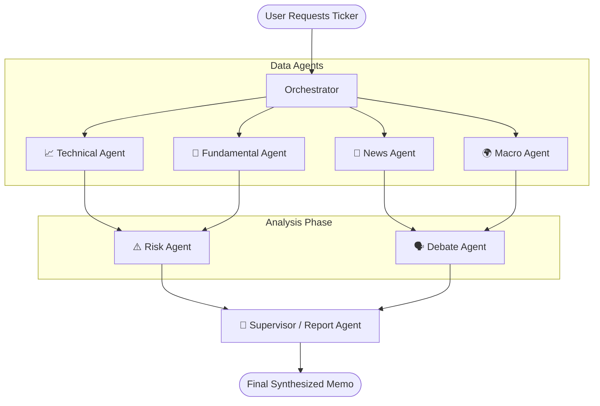

<div align="center">
  <a href="https://finsight-frontend-rjau.onrender.com/">
    
  </a>

  <p align="center">
    <strong>An AI-driven multi-agent research swarm and optimization platform.</strong>
  </p>

  <p align="center">
    <a href="https://finsight-frontend-rjau.onrender.com/">
      
    </a>
  </p>

  <p align="center">
    
    
    
    
    
  </p>
</div>

---

## 🌟 What is FinSight?

FinSight is an **investment research platform** driven by multiple specialized AI agents. Instead of replacing human judgment with automated trading, FinSight empowers researchers by gathering real-time market data, technical indicators, fundamental filings, news sentiment, and macro context. 

A **Supervisor Agent** orchestrates a debate among these specialized lenses, culminating in a citation-backed, synthesized investment memo.

> [!IMPORTANT]
> **Explicit Non-Goals**
> - **Not a real trading bot:** It never executes trades or connects to a brokerage.
> - **Not investment advice:** Every report is for research and demonstration purposes only.
> - **Not attempting to beat the market:** The value is in explainable synthesis, not in claimed returns.

---

## 🚀 Live Demo

Experience the swarm in action! The backend API and frontend are deployed on Render.

👉 **[Try FinSight Live](https://finsight-frontend-rjau.onrender.com/)**

*(Note: The initial load may take ~50 seconds if the free Render instance is waking from sleep. Subsequent analyses will be much faster!)*

---

## 🧠 Multi-Agent Architecture

FinSight uses a **Swarm Architecture** where distinct AI agents specialize in different aspects of financial analysis before debating and combining their findings.



See the detailed [Architecture Document](docs/architecture.md) for deeper component breakdowns.

---

## 💻 Tech Stack

| Domain | Technologies |
|---|---|
| **Backend** |    |
| **Frontend** | HTML/CSS/JS (Vanilla) interacting with REST API |
| **AI / Agents** |   |
| **Data & Storage** |    |
| **Infra & CI/CD** |    |

---

## ⚡ Quick Start (Local Development)

Get up and running locally in under 5 minutes:

1. **Clone the repository:**
   ```bash
   git clone https://github.com/vyash0048-bit/finsight.git
   cd finsight
   ```

2. **Environment Setup:**
   ```bash
   cp .env.example .env
   # Add your external API keys (Gemini, Finnhub, etc.) to .env
   ```

3. **Launch with Docker Compose:**
   ```bash
   docker-compose -f infra/docker-compose.yml up --build
   ```

4. **Access the application:**
   - Frontend: `http://localhost:8501` (or the configured port)
   - API Docs: `http://localhost:8000/docs`

---

## 🏗️ Key Design Decisions

- **Postgres + MongoDB Split:** Structured data (users, price bars) lives in Postgres for integrity and relational querying, while unstructured data (agent outputs, news, filings) lives in MongoDB for schema flexibility.
- **Hand-rolled Orchestration:** Provides exact control over the agent debate flow and failure isolation.
- **Read-Only / No Trading:** Sidesteps regulatory and liability concerns while showcasing complex multi-agent reasoning.

*Read more in the [Design Decisions](docs/design_decisions.md) document.*

---

## 🧪 Running Tests

To run the test suite locally:
```bash
cd backend
pip install -r requirements.txt
pytest --cov=app tests/
```

---

## 🗺️ Roadmap

- [ ] Enhance macro agent with more FRED indicators.
- [ ] Support multi-ticker portfolio correlation analysis.
- [ ] Implement streaming debate visualization in UI.
- [ ] Add user-defined evaluation rubrics for reports.
- [ ] Support open-weight local models (Ollama/vLLM).

---

## 🙏 Credits

Inspired by the academic prototype **StockAgent** (Zhang, Liu, Jin et al., 2024, arXiv:2407.18957).

<div align="center">
  <br>
  <i>Licensed under the MIT License. <br><b>This software is for educational purposes only and does not constitute financial advice.</b></i>
</div>
