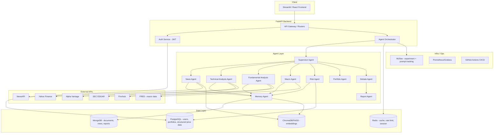

# System Architecture

FinSight uses a layered architecture to orchestrate multiple LLM agents, ingest diverse financial data, and serve results via a modern web stack.

## High-Level Component Diagram

## Layers Overview

1. **Client Layer:** A Streamlit frontend allows researchers to input a ticker, monitor the agent debate stream, and read the synthesized report.
2. **API Layer:** A FastAPI backend acts as the gateway. It handles JWT authentication, background task dispatching, and acts as the orchestrator to kick off the multi-agent debate.
3. **Agent Layer:** The core of FinSight. Specialized agents gather information using tools (e.g. News, Technicals, Macro). A Supervisor Agent dictates the debate flow and a Report Agent synthesizes the findings.
4. **Data Layer:** Uses Polyglot persistence. PostgreSQL for highly structured, tabular data (users, timeseries), MongoDB for unstructured logs and raw documents, ChromaDB for vector retrieval (RAG), and Redis for ephemeral caching.
5. **External APIs:** Integration with Yahoo Finance, SEC EDGAR, FRED, and NewsAPI provides real-world context for the agents.
